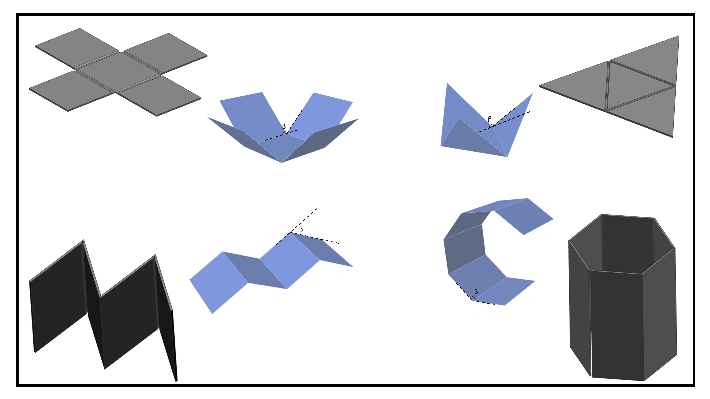

# Self-Deployable-Origami_Structures
4D printed objects could be used in the area of self deployable origami structures.

*General lay-out of the project

*Youtube video;
https://www.youtube.com/watch?v=wseZLTV9lcs
